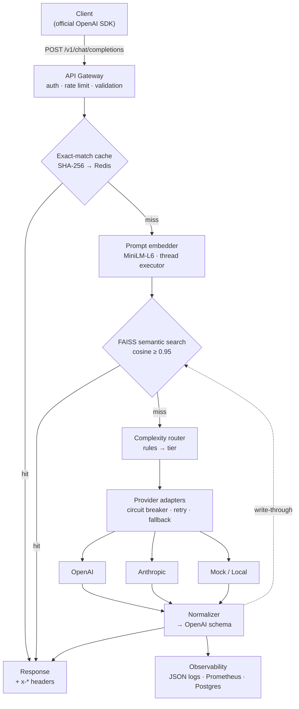

---

## 1. Repository Map

```
llm-gateway/
├── README.md                      # The front door — demo, results, quickstart
├── LICENSE                        # MIT
├── CHANGELOG.md                   # Phase-by-phase, shows build discipline
├── CONTRIBUTING.md                # Dev setup + conventions (short)
├── Makefile                       # run / test / lint / eval / load-test / chaos / demo
├── docker-compose.yml             # gateway + redis + postgres + prometheus + grafana
├── Dockerfile                     # multi-stage, embedding model pre-baked into image
├── .env.example                   # every config knob, documented
├── pyproject.toml
├── .github/workflows/ci.yml       # lint + full test suite, no network needed
│
├── src/llm_gateway/
│   ├── main.py                    # app factory, lifespan, route mounting
│   ├── config.py                  # pydantic-settings — all env-driven
│   ├── api/
│   │   ├── routes_chat.py         # POST /v1/chat/completions
│   │   ├── routes_embeddings.py   # POST /v1/embeddings
│   │   ├── routes_admin.py        # /v1/cache/invalidate · /v1/health
│   │   └── dependencies.py        # API-key auth + rate-limit dependencies
│   ├── schemas/
│   │   ├── openai_api.py          # OpenAI-compatible request/response models
│   │   └── errors.py              # OpenAI-style error envelope
│   ├── cache/
│   │   ├── service.py             # two-layer lookup: exact → semantic
│   │   ├── exact.py               # SHA-256 → Redis
│   │   ├── semantic.py            # FAISS IndexIDMap2 + SQLite payload store
│   │   ├── embedder.py            # MiniLM in a thread executor
│   │   └── policy.py              # cacheability: temp, stream, tools, turn count
│   ├── router/
│   │   ├── classifier.py          # rule-based tier assignment
│   │   ├── features.py            # token count, code detection, keywords
│   │   └── mapping.py             # tier → ordered provider list
│   ├── providers/
│   │   ├── base.py                # ProviderAdapter protocol + registry
│   │   ├── openai_adapter.py
│   │   ├── anthropic_adapter.py
│   │   ├── mock_adapter.py        # deterministic — powers tests/chaos/load/demo
│   │   └── normalizer.py          # any provider → OpenAI schema
│   ├── reliability/
│   │   ├── circuit_breaker.py     # closed → open → half-open
│   │   ├── retry.py               # backoff + jitter + timeout budgets
│   │   ├── fallback.py            # ordered chain walker
│   │   └── rate_limiter.py        # Redis token bucket
│   └── observability/
│       ├── logging.py             # structured JSON per request
│       ├── metrics.py             # Prometheus counters/histograms
│       ├── pricing.py             # pricing.yaml → cost estimation
│       └── repository.py          # RequestLog / CostRecord persistence
│
├── tests/
│   ├── unit/                      # router, cache policy, breaker, normalizer
│   ├── contract/                  # respx-recorded fixtures per adapter
│   ├── integration/               # end-to-end through the app (mock provider)
│   └── chaos/                     # provider outage → fallback + breaker assertions
│
├── evals/
│   ├── golden_set.jsonl           # ~150 labeled prompts
│   ├── labeling_rubric.md         # how labels were assigned — makes it defensible
│   └── run_router_eval.py         # confusion matrix, per-tier P/R
│
├── benchmarks/
│   ├── locustfile.py              # workload mixes: repeat-heavy vs. diverse
│   ├── threshold_sweep.py         # false-positive rate vs. similarity threshold
│   └── results/                   # raw CSVs + plots — COMMITTED
│
├── dashboards/grafana_dashboard.json
├── prometheus.yml
├── scripts/
│   ├── demo.sh                    # the 5-min demo as a runnable script
│   ├── chaos.sh                   # kill provider under load
│   └── seed_cache.py
│
└── docs/
    ├── DESIGN.md
    ├── API.md
    ├── BENCHMARKS.md
    ├── ROUTER_EVAL.md
    ├── RUNBOOK.md
    ├── DEMO.md
    ├── img/                       # screenshots + demo GIF
    └── adr/
        ├── 0001-rule-based-router-over-learned.md
        ├── 0002-two-layer-cache-exact-then-semantic.md
        ├── 0003-single-turn-caching-only.md
        ├── 0004-fail-loud-over-degraded-cache-serving.md
        ├── 0005-faiss-flat-with-documented-upgrade-path.md
        └── 0006-mock-provider-as-first-class-citizen.md
```

---

## 2. `README.md` — complete file

````markdown
<div align="center">

# LLM Gateway

**One OpenAI-compatible endpoint. Multiple providers. Semantic caching that
eliminates redundant spend. Cost-aware routing. Circuit breakers with
transparent fallback.**

[](https://github.com/YOUR_USERNAME/llm-gateway/actions)
[]()
[](LICENSE)
[]()

*Every claim on this page is backed by a benchmark in [`benchmarks/results/`](benchmarks/results/)
or a test in [`tests/`](tests/). Nothing here is asserted — it's measured.*

</div>

---

## The problem

Teams calling LLM APIs directly hit the same three walls:

1. **No unified interface** — OpenAI, Anthropic, and local models all speak different protocols.
2. **No cost control** — every call hits a paid API, even near-duplicate prompts asked minutes apart.
3. **No visibility** — latency, cost, and failure behavior are invisible until something breaks.

LLM Gateway is a single proxy that solves all three: one OpenAI-compatible API
surface, a semantic cache that avoids redundant paid calls, a deterministic
router that sends each request to the *cheapest model capable of handling it*,
and an observability layer that makes cost/latency/reliability measurable.

## The 30-second demo

Point the **official OpenAI SDK** at the gateway. Nothing else changes:

```python
from openai import OpenAI

client = OpenAI(base_url="http://localhost:8000/v1", api_key="gw-demo-key")

# 1 — The router picks the cheapest sufficient model
r = client.chat.completions.create(
    model="auto",   # virtual model; the gateway decides
    messages=[{"role": "user", "content": "Explain the circuit breaker pattern."}],
)
# x-routing-tier:  standard      ← router decision (rule_fired is in the logs)
# x-provider-used: anthropic     ← cheapest healthy provider serving that tier
# x-cost-usd:      0.0028
# latency:         914 ms

# 2 — Same question again: served from the semantic cache, for free
r = client.chat.completions.create(
    model="auto",
    messages=[{"role": "user", "content": "Explain the circuit breaker pattern."}],
)
# x-cache-hit:     true
# x-cost-usd:      0.0000
# latency:         6 ms          ← ~150x faster, $0.00

# 3 — A *similar* question with a different answer is never wrongly cached
r = client.chat.completions.create(
    model="auto",
    messages=[{"role": "user", "content": "Explain what a circuit breaker does in home electrical wiring."}],
)
# x-cache-hit:     false         ← similarity 0.87 < threshold 0.95 → live call
```

Step 3 is the part most semantic caches get wrong. Cache correctness is tested
adversarially — see [`tests/unit/test_cache_correctness.py`](tests/unit/test_cache_correctness.py)
and the [threshold sweep](docs/BENCHMARKS.md).

<!-- TODO(day 6): record a terminal GIF with vhs (scripts/demo.tape) and embed here -->

## Measured results

> ⚠️ Replace these example values with your own measured results before publishing.
> Every number must be reproducible: `make load-test`, `make eval`, `make test`.

| Metric | Result | Reproduce with |
|---|---|---|
| Gateway overhead on cache miss (p95) | +9 ms vs. direct provider call | `make load-test` |
| Cache hit latency (p95) | 6 ms | `make load-test` |
| Spend eliminated on repeat-heavy workload | 31% | `benchmarks/locustfile.py`, workload W1 |
| Max throughput (mock providers) | 210 RPS | `make load-test` |
| Router tier accuracy (macro F1, golden set) | 0.87 | `make eval` |
| Semantic cache false positives | 0 / 50 adversarial pairs | `make test` |
| Provider failover on outage | 1.2 s to fallback; breaker opens at 50% error rate | `make chaos` |

Full methodology: [`docs/BENCHMARKS.md`](docs/BENCHMARKS.md) · Router eval: [`docs/ROUTER_EVAL.md`](docs/ROUTER_EVAL.md)

## Architecture



Full design: [`docs/DESIGN.md`](docs/DESIGN.md)

## What's inside

| Pillar | What it does | Where |
|---|---|---|
| **Unified API** | OpenAI-compatible `/v1/chat/completions`; existing SDKs work unmodified | `src/llm_gateway/schemas/` |
| **Semantic cache** | Two layers: exact-match (SHA-256, 100% safe) then FAISS cosine ≥ 0.95; single-turn, low-temperature requests only; near-misses logged for threshold calibration | `src/llm_gateway/cache/` |
| **Cost-aware routing** | Deterministic rule classifier → cheap/standard/premium; every decision logs which rule fired; overridable per-request | `src/llm_gateway/router/` |
| **Reliability** | Circuit breakers (closed→open→half-open), retries with jittered backoff, timeout budgets, ordered fallback chains | `src/llm_gateway/reliability/` |
| **Observability** | Structured JSON logs, Prometheus metrics, per-request cost attribution, Grafana dashboard | `src/llm_gateway/observability/` |

## Quickstart

```bash
git clone https://github.com/YOUR_USERNAME/llm-gateway
cd llm-gateway
cp .env.example .env
docker compose up -d          # gateway + redis + postgres + prometheus + grafana
```

```bash
# Health check
curl -s localhost:8000/v1/health | jq

# First request (router decides tier)
curl localhost:8000/v1/chat/completions \
  -H "Authorization: Bearer gw-demo-key" \
  -H "Content-Type: application/json" \
  -d '{"model": "auto", "messages": [{"role": "user", "content": "Hi"}]}' -i
```

**No API keys? It still runs.** A built-in `MockProvider` (same adapter
interface as real providers, configurable latency/error-rate) means the entire
system — routing, caching, chaos failover, load tests, dashboard — is fully
demoable at zero cost. Leave `OPENAI_API_KEY`/`ANTHROPIC_API_KEY` empty and the
fallback chain terminates on the mock.

- Swagger docs: `http://localhost:8000/docs`
- Grafana: `http://localhost:3001` (dashboard auto-provisioned)
- Prometheus: `http://localhost:9090`

## Key design decisions

| # | Decision | Why | ADR |
|---|---|---|---|
| 1 | Rule-based router, not a learned one | every decision explainable in one line; no training-data risk | [ADR-0001](docs/adr/0001-rule-based-router-over-learned.md) |
| 2 | Two-layer cache: exact then semantic | exact hits are free and 100% safe; semantic layer handles paraphrase | [ADR-0002](docs/adr/0002-two-layer-cache-exact-then-semantic.md) |
| 3 | Cache single-turn requests only | multi-turn near-matches are the #1 correctness hazard | [ADR-0003](docs/adr/0003-single-turn-caching-only.md) |
| 4 | Fail loud when all providers are down | silently serving plausible-but-wrong cache entries is worse than a 503 | [ADR-0004](docs/adr/0004-fail-loud-over-degraded-cache-serving.md) |
| 5 | FAISS `IndexFlatIP` now, IVF+PQ documented later | exact search is correct at v1 scale; upgrade path is written down | [ADR-0005](docs/adr/0005-faiss-flat-with-documented-upgrade-path.md) |
| 6 | MockProvider is a first-class citizen | deterministic tests, free load tests, reproducible demos | [ADR-0006](docs/adr/0006-mock-provider-as-first-class-citizen.md) |

## Testing & evaluation

```bash
make test        # unit + contract (recorded HTTP fixtures) + integration + chaos
make eval        # router golden-set eval → confusion matrix, per-tier P/R
make chaos       # kill primary provider under load; assert fallback + breaker
```

- **Contract tests** use recorded HTTP fixtures — the suite never touches live
  APIs and runs in CI in seconds.
- **Cache-correctness tests** are adversarial by design: pairs of similar prompts
  with *different* correct answers must never cross-hit.
- **Chaos tests** simulate provider outages and assert the fallback chain and
  circuit breaker behave as specified.
- The **router eval** runs against a labeled golden set with a written labeling
  rubric ([`evals/labeling_rubric.md`](evals/labeling_rubric.md)).

## Repository layout

```
src/llm_gateway/    gateway service (api · cache · router · providers · reliability · observability)
tests/              unit · contract · integration · chaos
evals/              golden set + labeling rubric + eval runner
benchmarks/         locust + threshold sweep + committed results
docs/               design, ADRs, benchmarks, runbook, demo script
dashboards/         importable Grafana dashboard JSON
scripts/            demo.sh · chaos.sh · seed_cache.py
```

## Documentation

| Doc | Contents |
|---|---|
| [`docs/DESIGN.md`](docs/DESIGN.md) | Full system design — components, data models, failure handling |
| [`docs/API.md`](docs/API.md) | Endpoints, headers, virtual models, error codes, curl examples |
| [`docs/BENCHMARKS.md`](docs/BENCHMARKS.md) | Benchmark methodology + results |
| [`docs/ROUTER_EVAL.md`](docs/ROUTER_EVAL.md) | Router golden-set evaluation |
| [`docs/RUNBOOK.md`](docs/RUNBOOK.md) | Failure modes → diagnosis → action |
| [`docs/DEMO.md`](docs/DEMO.md) | The 5-minute guided walkthrough |
| [`docs/adr/`](docs/adr/) | Architecture decision records |

## Roadmap

- [x] Phase 0 — passthrough proxy, OpenAI-compatible in/out, MockProvider
- [x] Phase 1 — second provider + fallback chain + normalizer
- [x] Phase 2 — two-layer semantic cache (feature-flagged)
- [x] Phase 3 — rule-based complexity router + golden-set eval
- [x] Phase 4 — observability pipeline + Grafana dashboard
- [x] Phase 5 — circuit breakers, rate limiting, auth, chaos tests
- [ ] Phase 6 — streaming passthrough, learned router v2 (same interface), Gemini adapter, K8s

## Author

**Ishant** — built as a systems-design exercise in treating LLM spend as an
engineering problem: measurable, debuggable, reliable.
````

---

